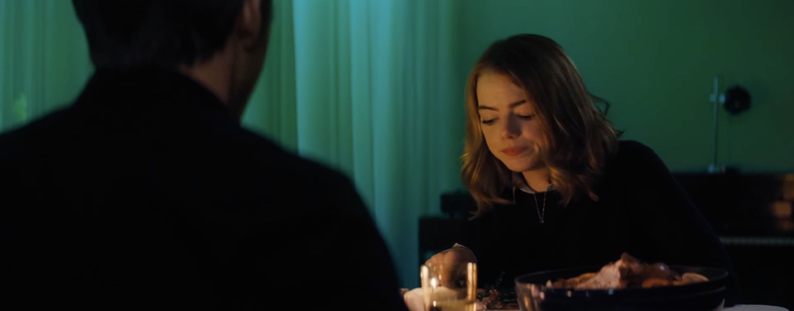

# Bonus Scene Study A — Mia & Seb Dinner Fight, La La Land (2016)

## Motive

In this scene, the large blue curtain appears to signal tension and misery too directly. The emotional intention is clear, but the move feels stylistically abrupt compared with the rest of *La La Land*, which generally operates in a vivid, musical, and coherent color world. The concern is not that blue cannot represent sadness, but that this particular use feels closer to the language of *Blue Valentine* than to the internal grammar established by this film.

This study asks: **How can the same emotional collapse be redesigned so it feels native to *La La Land* rather than imported from another visual system?**

## Analysis

- The current cold-blue dominance reads as explicit emotional labeling.
- It creates a tonal jump against the film’s earlier saturated primaries and romantic stylization.
- The scene communicates conflict effectively, but with less continuity in visual logic.
- A stronger approach would preserve emotional impact while making the transition feel like a **decay of their shared world** rather than a color switch.

## Proposed Redesign

### Color progression

- Begin with established warm interior tones (amber/tungsten).
- As argument escalates, reduce saturation progressively.
- Let reds lose vitality, yellows turn dull, and skin tones flatten slightly.
- Keep the emotional shift gradual, not symbolic.

**Clip references:**
- *Revolutionary Road* (2008) — domestic conflict with warmth draining over time.  
  YouTube: https://www.youtube.com/results?search_query=Revolutionary+Road+argument+scene
- *Marriage Story* (2019) — argument scene with progressively flatter emotional color feeling.  
  YouTube: https://www.youtube.com/results?search_query=Marriage+Story+argument+scene

### Lighting progression

- Keep sources practical and motivated.
- Shift from cozy balance to uneven contrast as tension rises.
- Introduce split-lighting and falloff imbalance between characters.
- If cool tones appear, let them creep from outside contamination, not from a dominant blue object.

**Clip references:**
- *The Godfather* (1972) — motivated practical lighting intensifying pressure.  
  YouTube: https://www.youtube.com/results?search_query=The+Godfather+restaurant+scene
- *Zodiac* (2007) — practical-light falloff and darkness creep driving tension.  
  YouTube: https://www.youtube.com/results?search_query=Zodiac+basement+scene
- *Sicario* (2015) — warm palette contaminated by cool night influence.  
  YouTube: https://www.youtube.com/results?search_query=Sicario+night+scene+lighting
- *Drive* (2011) — warm practicals mixed with cool spill for emotional instability.  
  YouTube: https://www.youtube.com/results?search_query=Drive+apartment+scene+lighting

### Framing and blocking progression

- Open with shared framing and relational proximity.
- Add subtle visual barriers: chair backs, door frames, negative space.
- Move toward isolated singles and divided architecture.
- Reduce crossing paths so emotional distance becomes spatially explicit.

**Clip references:**
- *Marriage Story* (2019) — progression from shared frame energy to isolation.  
  YouTube: https://www.youtube.com/results?search_query=Marriage+Story+argument+scene+framing
- *Blue Valentine* (2010) — conflict externalized through barriers and separation.  
  YouTube: https://www.youtube.com/results?search_query=Blue+Valentine+fight+scene

### La La Land motifs to preserve and then break

Use familiar film language first, then fracture it.

- **Chromatic romance:** keep early warm harmony, then de-harmonize gradually.
- **Lyrical practical glow:** start soft and poetic, then let mixed light become uncomfortable.
- **Romantic two-shot balance:** begin centered and unified, then divide into asymmetrical singles.
- **Musical camera flow:** start fluid, then progressively reduce movement until stillness.

**Clip references:**
- *A Lovely Night* (2016) — color and movement harmony.  
  YouTube: https://www.youtube.com/results?search_query=La+La+Land+A+Lovely+Night+scene
- *Someone in the Crowd* (2016) — saturated coherence and musical visual rhythm.  
  YouTube: https://www.youtube.com/results?search_query=La+La+Land+Someone+in+the+Crowd+scene
- *City of Stars* (2016) — practical glow with emotional lyricism.  
  YouTube: https://www.youtube.com/results?search_query=La+La+Land+City+of+Stars+pier+scene
- *Another Day of Sun* (2016) — fluid camera rhythm and choreographed motion.  
  YouTube: https://www.youtube.com/results?search_query=La+La+Land+opening+Another+Day+of+Sun+scene

### Beat map for this scene

- **Beat A (start):** warmth, shared frame, fluid rhythm.
- **Beat B (rise):** reduced saturation, uneven practical contrast, early framing asymmetry.
- **Beat C (break):** isolated singles, blocked sightlines, static rhythm, mixed-light discomfort.
- **Beat D (aftershock):** near-neutral low-saturation emptiness instead of symbolic blue dominance.

## Core Design Principle

The redesign target is consistency: emotion should feel like a **collapse from within the film’s existing visual language**. The scene should move from intimacy to fracture through gradual dissonance in color, light, framing, and rhythm.

## Task tracking

Checklist tracking for this bonus study is managed in `PROGRESS.md`.
