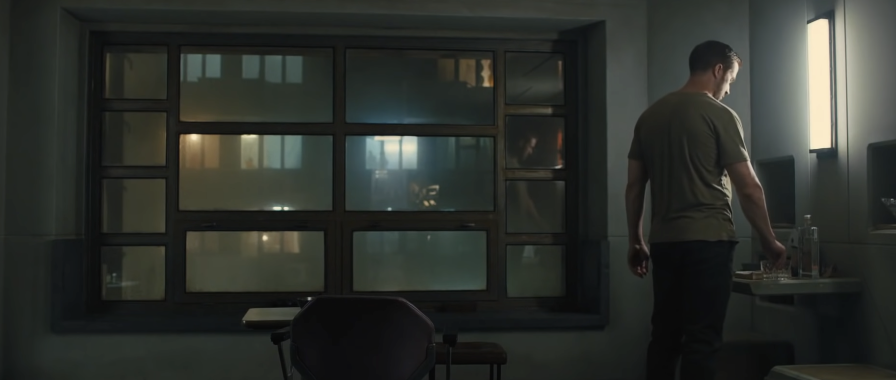
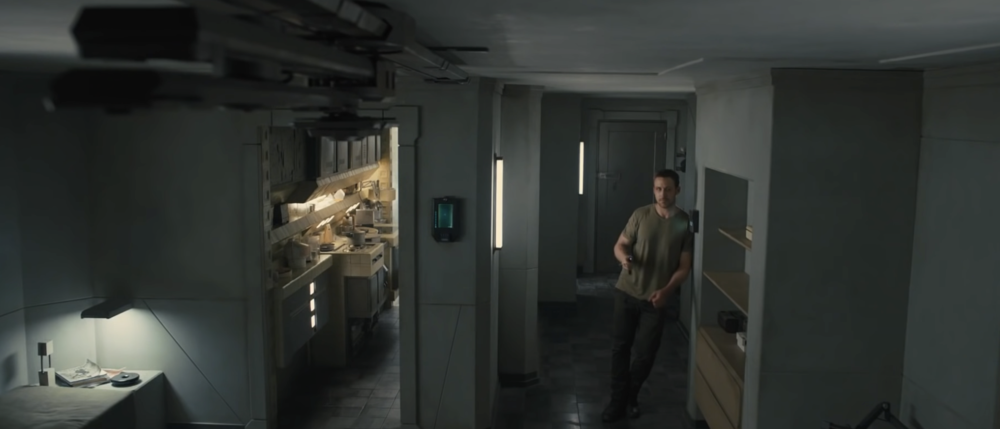

# Scene Study #1 - K's room in Bladerunner2049

## Reference Images

## Story

* What is happening emotionally?
  * Alone, confined space, cold, industrial, a way to look outside but no way out.
* Whose space is this?
  * K's. Skinner. dispised on the outside, a private space in the inside. been here for a while, some personal belongings, but nothing much. Default furniture that comes with the apartment. Akward low quality furniture.
* What changed in the room because of the story?
  * Joi. His companion. Brings joy, laughter, warmth. BGM changes to bring warmth. Colored cloth, real food (projections). a second chair. second glass. a book. A projection device.

## Character

* income level
  * Low to none. Apartment are assigned with the job. cheap whiskey. cheap food. cheap smoke. weared cloth. low material desire. only spent on projection device.
* habits
  * clean and tidy. empty table. chairs at the same place. no watermarks but weared out through the years. a smoke after work. everyday. clean ashtray. no snacks. blank out, staring at the wall for the night. quick shower. working pants even at home. bare foot. clean floor. tidy kitchen counter. alarm clock, early to work. dinner and chat with Joi. Nothing much to share.
* taste
  * No taste. No personal belongings. cheap whiskey is actually water. regular water cup. shelfs empty. no tast for food. don't care about cloth. regular T-shirt to work. does not recognize any trend. no interest in reading. 
* age
  * Unknown. body of 20-30. But feels a lot older. scars and wrinkles on the hand and neck. Walking of a 40 years old. tired. 
* emotional state
  * Calm, even when he got hurt at work. Only a weak, tired smile when talking to joi, and no works, no excitement, no emotion at any other given time. Nothing surprises him. Cares about Joi, but hard to tell if he actually cares or is he only hanging on to this only person to talk to. Does not share about himself.
* What they keep visible vs hidden
  * Emotions are hidden, only calm and supportive towards joi. Scars are hidden, wounds are hidden. Blooded cloth are hidden in a truck. doesn't need light, nothing to show whatsoever. Food wrapper is the only thing. He does not bring anything back from work. 
  
## Space

* proportions
  * The room feels compact but not tiny. The window wall takes up a very large portion of the frame, which makes the room feel more like a cell built around a view shaft than a comfortable home. The ceiling and wall planes feel slightly heavy and enclosing, so even though the room has decent height, it does not feel airy. The proportions suggest a functional living pod, not a personalized apartment.
* flow
  * The flow seems very controlled and minimal. There appears to be:
    * a central open area
    * furniture pushed to edges
    * one main usable path along the right side where K is standing
    * a seated/viewing zone near the window
  * This makes the room feel easy to move through, but also emotionally restrained. It is arranged for basic routines, not for hosting, lounging expansively, or expressive living.
* Symmetry or asymmetry
  * The composition is built on a strong near-symmetry: the big window grid is highly symmetrical, the room framing is centered, the chair is roughly centered in the foreground. But K himself is placed off to the right, breaking that order. That is useful dramatically. The space wants to feel rigid, controlled, and systematized; the figure introduces a human imbalance inside that order. So the set gives you architectural symmetry with lived asymmetry.
* Crowded or sparse
  * Very sparse. There are only a few visible objects
* Practical entrances/exits
  * The screenshot does not show the door clearly, but the room reads as if circulation is simple and efficient.
* Windows and light sources
  * The window is dominant, but it is not giving a clear naturalistic daylight feel. It functions more like a screen of ambient urban glow. The frosted/blurred panes obscure the outside world while still letting in atmosphere.
  * Visible light sources:
    * wall-mounted vertical light on the right
    * `Only lights up the counter on the right, but no suffucient lighting for the dining area in the middle. And K just lives with it.`
    * diffused exterior city light through the window
    * possibly practical interior bounce from unseen fixtures
  * This layering is important. The room is lit in a way that feels part institutional, part urban, part cinematic. It is not cozy residential lighting. 
  
## Design language

* shape language
  * disciplined, engineered, modular feel. rectilinear: window grid, wall panels, table planes, mirror/screen rectangles, vertical light bar
  * `Few softer shapes, like the chair curve or the human body. Feels like the chair and the man do not belong.`
* color palette
  * blue-green / cyan in the shadows and window glow
  * dirty warm amber in some distant background lights
  * grayed neutrals on walls and furniture
  * low-saturation skin and fabric tones
  * emotionally cold, with faint traces of human warmth that never fully take over.
* Repeated motifs
  * rectangle / grid: window panes, wall divisions, mirror/screen shapes, light fixture proportions
  * Another repeated motif is framing within framing: room frame, window frame, pane subdivisions, reflected interior layers in the glass
* Object density
  * Low object density. Very few things are visible, and the visible ones are carefully spaced.
* Old vs new
  * `The room feels like future infrastructure that has already aged.`
  * New: modular lighting, clean integrated wall surfaces, technological urban housing concept, sleek simple fixtures
  * Old / worn: hazy, weathered feeling, slightly institutional wall finish, dull surfaces, atmosphere of accumulated use rather than pristine futurism
* Soft vs hard textures
  * Mostly hard textures: glass, painted wall panel, metal frame, hard table surfaces, polished or semi-polished fixtures
  * Softness is minimal: clothing, maybe chair, atmospheric diffusion in light

## Realism

* What makes it believable?
  * It feels like a real small residence adapted to a dense urban world.
  * The wear level is controlled. That is believable for someone disciplined and solitary.
  * objects feel function-first
  * room reflects a social reality
* What details make it specific rather than generic?
  * the window design. It is not just “big sci-fi window.” The grid, scale, frosting, and urban glow make it feel like this exact housing type in this exact world.
  * the slightly oppressive wall thickness and inset window depth, which gives the architecture mass
  * the restrained furnishing, which tells you about K specifically
