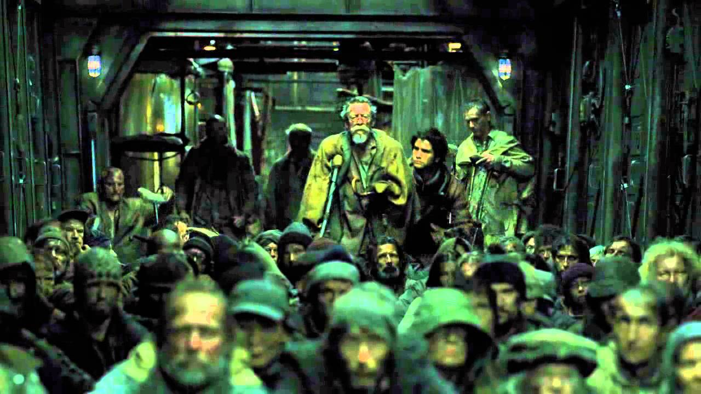
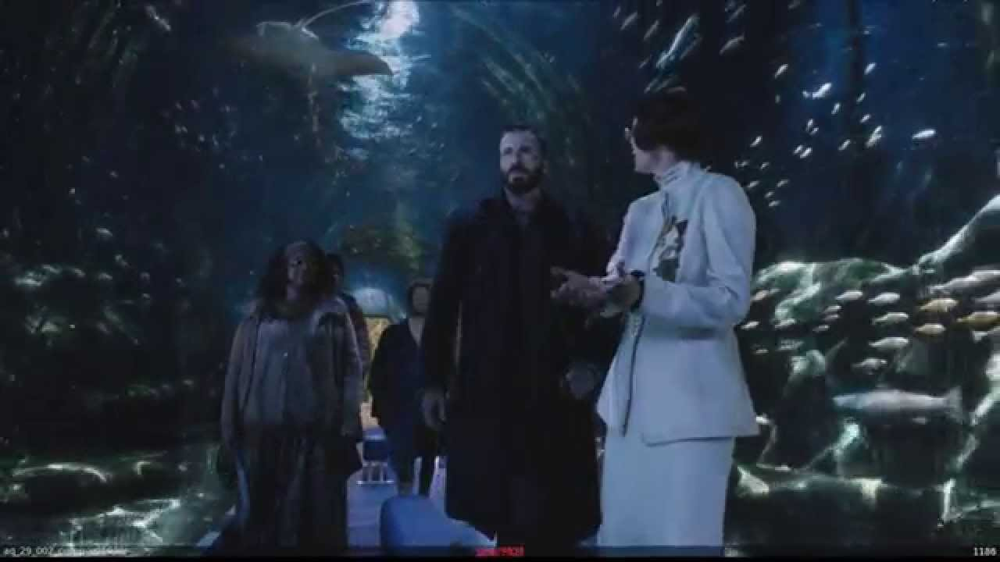

# Scene Study #3 Front vs Tail, Snowpiercer (2013)

## Reference Clips

- Tail section: ["SNOWPIERCER Official Character Clip - Tail Section -" by CJ ENM](https://www.youtube.com/watch?v=Y33o7kJmzwc)
- Front section: ["Snowpiercer" - VFX Breakdown - Aquarium Sushi Bar by cinefexmagazine](https://www.youtube.com/watch?v=FhPzoFS5_VU)

## Reference Images

## Study Focus

This study compares two separate interiors from the same train: the tail section, where the lower class is compressed into survival conditions, and the front aquarium/sushi bar car, where the upper class experiences luxury, spectacle, and controlled abundance. The main question is how production design turns class into space.

# Scene A: Tail Section

## Story

* **What is happening emotionally?**

  * The tail section feels like a space of exhaustion, pressure, and collective anger. People are packed together with almost no visual privacy, so emotion becomes public by default. The scene carries a sense of long-term deprivation rather than a single moment of crisis; the room itself feels like it has been holding resentment for years.

* **Whose space is this?**

  * This is the space of the passengers who were pushed to the back of the train and treated as cargo rather than guests. It belongs to the group more than to any individual. The design makes personal identity hard to preserve because everyone must share the same air, light, floor, walls, and scarcity.

* **What changed in the room because of the story?**

  * The tail section begins as an imposed prison, but the story turns it into the origin point of rebellion. The same cramped corridor that expresses oppression also becomes a staging ground for collective movement. The space does not become visually richer; it becomes politically charged.

## Character

* **income level**

  * Extreme poverty. The passengers have almost no personal property and no access to comfort, color, privacy, or softness. The design shows class through what is missing: no rooms, no decoration, no fresh surfaces, no choice.

* **habits**

  * Habits are communal and survival-based: sitting close, sleeping in public, waiting, watching, sharing information, and conserving energy. The space suggests routines shaped by rationing, crowding, and constant surveillance.

* **taste**

  * Taste has been stripped away. The tail section is not an expression of preference but an expression of deprivation. Any visual individuality comes through worn clothing, patched layers, bodies, and improvised survival rather than intentional decoration.

* **age**

  * The space holds multiple generations together, which makes it feel like a whole society compressed into one industrial corridor. Children, adults, and elderly passengers occupy the same hard environment.

* **emotional state**

  * The emotional state is tense, tired, guarded, and suspicious. Even when people are still, the room feels unstable because the density of bodies creates pressure. The dominant feeling is contained unrest.

* **What they keep visible vs hidden**

  * Nearly everything is visible: bodies, weakness, hunger, age, illness, frustration, and fear. What remains hidden is interior life: private grief, private memory, and any sense of a home before the train.

## Space

* **proportions**

  * Long, narrow, and low-feeling. The train car format becomes oppressive because there is no relief from the corridor axis. The depth of the image shows bodies receding into more bodies, making the space feel endless but not expansive.

* **flow**

  * Flow is blocked by overcrowding. Movement is possible only by pushing through people or following the single lengthwise direction of the train. The space is built for containment, not circulation.

* **Symmetry or asymmetry**

  * The architecture is roughly symmetrical because of the train car shell, but the lived surface is asymmetrical: people slump, lean, crouch, and cluster unevenly. This tension makes the car feel controlled by structure but overwhelmed by human need.

* **Crowded or sparse**

  * Extremely crowded. The space is dense with people but sparse in objects. That contrast is important: human bodies replace furniture, decoration, and comfort.

* **Practical entrances/exits**

  * Entrances and exits feel restricted and guarded. The car reads as a dead-end social world, even though physically it is part of a train. The doorways are less about freedom of movement and more about control.

* **Windows and light sources**

  * Light is artificial, dim, green-blue, and industrial. There is little or no natural visual access to the outside world. The lighting makes the air feel stale and the metal surfaces feel cold.

## Design Language

* **shape language**

  * Hard verticals, exposed frames, pipes, rectangular doorways, and tunnel-like repetition. The shapes suggest machinery, infrastructure, and confinement rather than domestic life.

* **color palette**

  * Dirty greens, cold blues, gray-black shadows, worn browns, and sickly yellow highlights. The palette feels contaminated and underlit.

* **Repeated motifs**

  * Repeated heads, bundled clothing, metal ribs, pipes, narrow doorframes, hanging fixtures, and layered grime. Repetition supports the idea of social compression.

* **Object density**

  * Object density is low compared with body density. Props are practical, worn, and backgrounded; the main design mass is people, clothing, and industrial shell.

* **Old vs new**

  * Everything feels old, used, and degraded. The space has the look of infrastructure that was never meant to be lived in, then was lived in too long.

* **Soft vs hard textures**

  * Hard textures dominate: metal, pipes, rails, structural ribs. Softness appears only in dirty clothing, blankets, and bodies, which makes softness feel vulnerable rather than comforting.

## Realism

* **What makes it believable?**

  * The tail section feels believable because it is not over-decorated as "poverty." It is mostly a lack of space, lack of light, lack of objects, and lack of choice. The crowding, worn clothing, dirty surfaces, and practical industrial structure make the oppression physical.

* **What details make it specific rather than generic?**

  * The train-car geometry makes the poverty specific. This is not a slum, basement, or prison cell; it is a moving industrial tube converted into a human storage compartment. The class system is built directly into the direction of the train.

# Scene B: Front Section: Aquarium / Sushi Bar

## Story

* **What is happening emotionally?**

  * The front section produces awe, seduction, and moral discomfort. It is beautiful in a way that feels obscene because the audience has already seen deprivation in the tail. The aquarium car makes privilege feel like spectacle: survival has been transformed into entertainment.

* **Whose space is this?**

  * This is the space of the wealthy passengers and the system that serves them. It belongs to people who expect the end of the world to remain curated, clean, and pleasurable. Workers may operate inside it, but the design language belongs to consumption and display.

* **What changed in the room because of the story?**

  * As Curtis moves forward, the car changes from a luxury environment into evidence. The aquarium is not just beautiful; it proves that the train can preserve resources for pleasure while the tail starves. The room becomes an argument about allocation.

## Character

* **income level**

  * Extreme wealth and access. This car represents passengers who have paid for rarity: seafood, glass architecture, spectacle lighting, clean clothing, and space to move.

* **habits**

  * Habits are ritualized and curated: dining, viewing, strolling, being served, admiring controlled nature, and treating scarcity as refinement. The design suggests people accustomed to having survival hidden behind service.

* **taste**

  * Taste is expensive, futuristic, theatrical, and controlled. The aquarium turns nature into architecture, and the sushi bar turns food into performance. The space values novelty and exclusivity.

* **age**

  * The car feels adult and elite, but not domestic. It is not a family room or a bedroom; it is a venue. Its maturity comes from polish, restraint, and a designed hospitality experience.

* **emotional state**

  * The upper-class emotional state implied by the space is calm, entitled, and insulated. For Curtis and the rebels, the same beauty creates shock and disorientation.

* **What they keep visible vs hidden**

  * The front keeps beauty, abundance, cleanliness, and technological control visible. It hides labor, scarcity, violence, waste, and the social cost that makes the luxury possible.

## Space

* **proportions**

  * The car feels expanded beyond normal train proportions. The glass tunnel and aquarium walls create a sense of vertical and lateral openness, even though it is still inside a train.

* **flow**

  * Flow is smooth and ceremonial. Characters can walk through a display corridor, pause, look, and be served. Movement is designed as an experience rather than a struggle.

* **Symmetry or asymmetry**

  * The tunnel geometry is strongly symmetrical, with curved glass and repeated fish movement around the central path. The composition feels designed, balanced, and expensive.

* **Crowded or sparse**

  * Sparse compared with the tail. The space gives people room to stand apart, move freely, and be seen as individuals. Even visual abundance is contained in the aquarium rather than in human crowding.

* **Practical entrances/exits**

  * The car is a passage but also a destination. Unlike the tail, where the corridor traps people, this corridor stages movement as privilege. Doors and transitions feel controlled, clean, and intentional.

* **Windows and light sources**

  * The main "window" is the aquarium itself. Blue aquatic light replaces daylight and gives the space an impossible luxury: a private ocean inside a frozen train. Reflections and water movement create soft spectacle.

## Design Language

* **shape language**

  * Curved glass, tunnel forms, smooth counters, clean uniforms, and fluid fish movement. The shape language is organic but technologically contained.

* **color palette**

  * Deep blues, cool silvers, clean whites, black water shadows, and small flashes of reflected light. The palette is cold but luxurious rather than dirty.

* **Repeated motifs**

  * Fish, glass, water reflections, curved tunnel ribs, polished surfaces, and white service clothing. Repetition communicates controlled abundance.

* **Object density**

  * Object density is selective. There are fewer visible objects than expected because the aquarium itself is the main object. Luxury is expressed through space, polish, and rarity rather than clutter.

* **Old vs new**

  * The car feels new, engineered, and maintained. Even if the train has been running for years, this section is preserved as a premium environment.

* **Soft vs hard textures**

  * Hard materials dominate physically: glass, metal, polished surfaces. But the lighting and water soften them visually. The result is a cold luxury that still feels sensual.

## Realism

* **What makes it believable?**

  * The aquarium car works because its fantasy is tied to system logic: the train is a self-contained ark, so food production, spectacle, and hierarchy can occupy the same car. The luxury is absurd, but the production design makes it legible as engineered privilege.

* **What details make it specific rather than generic?**

  * The front section is not simply "rich people have nice things." It is a first-class ocean inside a train crossing a dead frozen world. The contradiction between climate apocalypse and curated seafood makes the design specific to Snowpiercer.

# Comparison Notes

## Class As Direction

The most important design idea is that class is spatially linear. Moving forward in the train means moving upward in class. The tail is a compressed corridor of survival; the front aquarium car is a curated corridor of spectacle. Both are train passages, but one is built to trap bodies and the other is built to display privilege.

## Density

The tail is dense with people and poor in objects. The front is sparse with people and rich in environment. This inversion is the clearest production-design expression of class.

## Light

The tail uses sickly artificial light that makes the air feel dirty and trapped. The front uses blue aquarium light that makes artificiality feel magical. Neither space is truly natural, but the front can afford to make artificial light beautiful.

## Texture

The tail is rough, matte, dirty, and layered. The front is reflective, smooth, cold, and controlled. The tail absorbs light; the front reflects it.

## Main Lesson For Production Design

The strongest contrast is not just "poor room vs rich room." It is deprivation vs curation. The tail section is designed around what people are denied. The front section is designed around what people are allowed to consume, admire, and waste.
